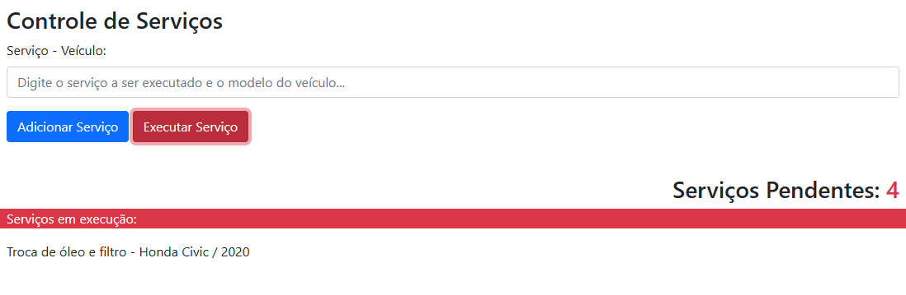

<strong><h1 align="center">Controle de Serviços</h1></strong>

  

## 🚀 Tecnologias

Esse projeto foi desenvolvido com as seguintes tecnologias:

- HTML
- BOOTSRAP
- JAVA SCRIPT

---

Acesse o site clicando ▶️[AQUI!](https://arthurberto.github.io/controle-de-servicos/)◀️

Feito com ♥ by Arthur Berto